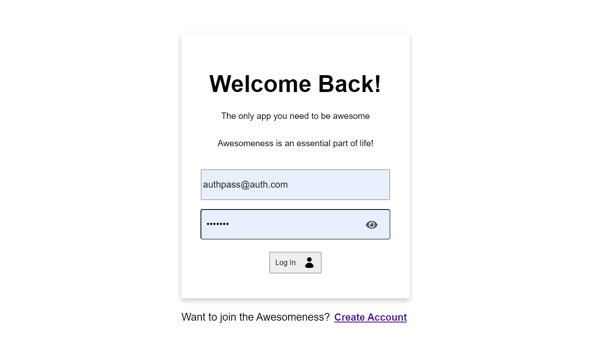
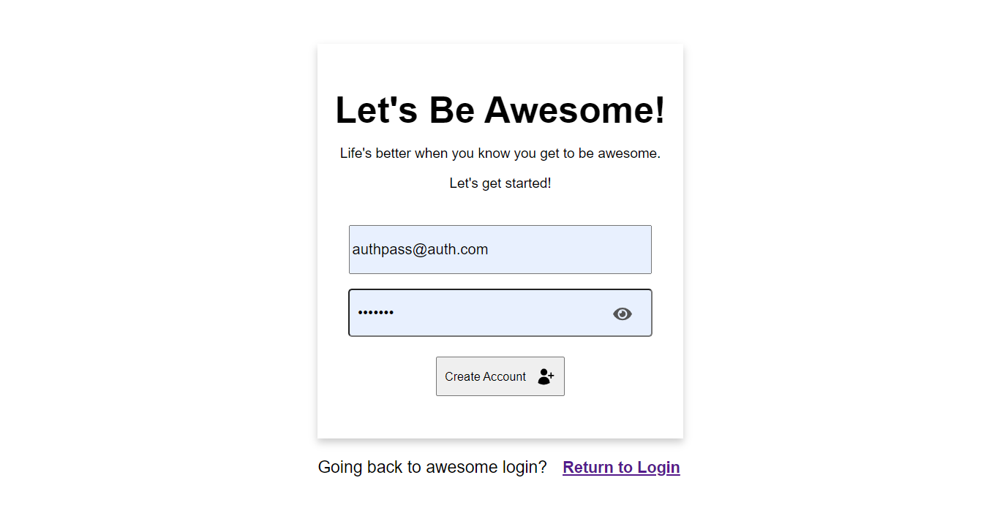
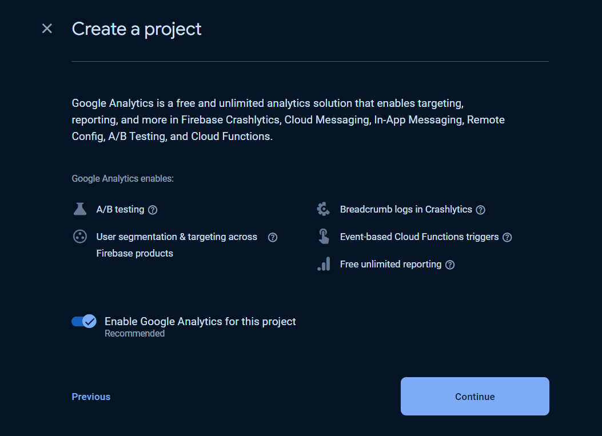
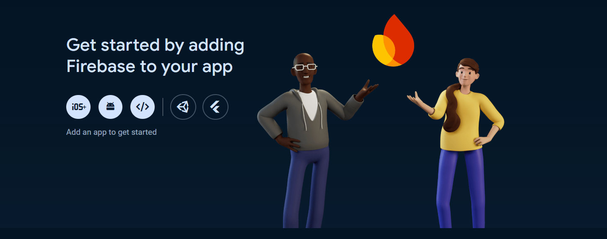
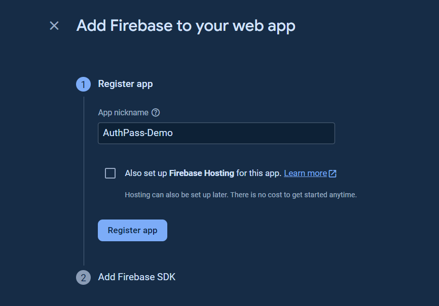
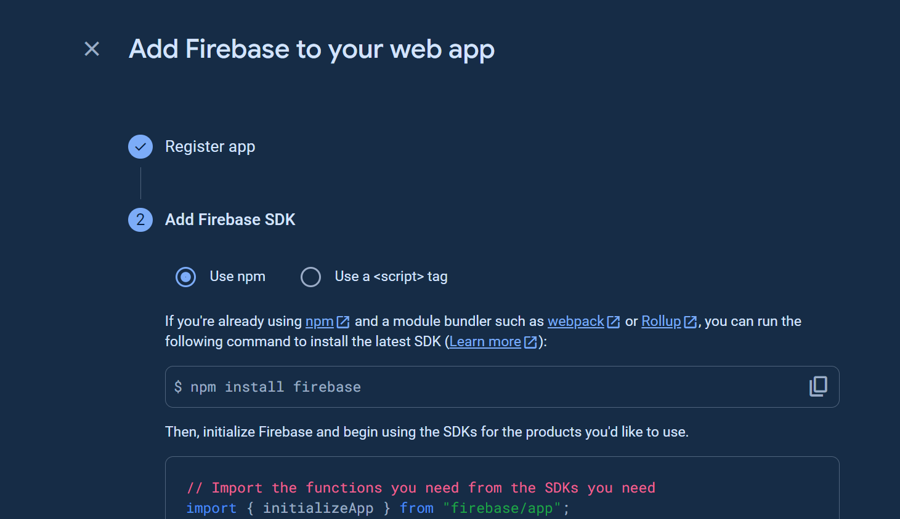
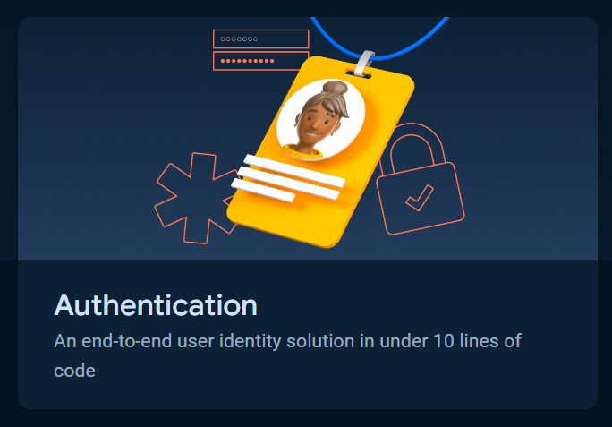

# AuthPass

`AuthPass` is a boiler plate set-up using `Firebase Authentication` providing a simple setup for user authentication with a pre-built login and registration page.

## Features

- **Firebase Authentication**: Seamlessly integrate Firebase Auth for user authentication.
- **Pre-configured Pages**: Includes pre-built pages for Login and Registration.

## Pre-Requirements
- **Vite**: Uses Vite as a build platform
- **Firebase Account**: Account is free, any other chosen services are subject to cost. Set up is relatively easy. See below for additional set-up information. 

  
### Login Page


### Register Page


# Starting Set Up
Before you get started there are a few quick steps you need to do to make sure `AuthPass` works correctly. 

### Step 1: Clone the repository
  - Go to your specfic file directory
    ```bash
      cd path/to/your/directory
    ```
  - Copy the following and paste into your terminal: 
    ```bash
      git clone https://github.com/sokuenryan/AuthPass.git
    ```
  - Open AuthPass folder in your directory
    ```bash
      cd path/to/your/directory/AuthPass
    ```

### Step 2: Run the following commands in your terminal
AuthPass uses Vite builder and react-icons for icon use. Run the following commands and ensure everything is working correctly. 

```bash
    npm install @vitejs/plugin-react
    npm install react-icons
```

# Firebase Setup
To use the authentication functionality provided by `AuthPass`, you'll need to set up a Firebase account and project. This is required because `Firebase Authentication` handles the login and registration processes. Follow these simple steps to configure Firebase for your app:

## Step 1. Create a Firebase Project
- Go to [https://console.firebase.google.com](https://console.firebase.google.com/). and sign in.
- Click on **Add Project**.
- Enter your project name and click **Continue**.
- Disable **Google Analytics** (if you don't need it), then click **Create Project**.
  
 

 ### Once your project is created, click **Continue** to open the project dashboard.

## Step 2. Add Firebase to Your Web App

  
  
- In your Firebase project, click on the `</>` (Web) icon to create a new Web app.
- Register the app with a name of your choice, then click **Register App**.



## Step 3. Update `firebase-config.js`

# IMPORTANT!
### This part contains **`sensative information!`** 
### ***When creating your Github repo be EXTRA SURE to hide this in your .gitignore file for security and privacy reasons.***



  1. Firebase will provide a configuration object with API keys.
  
  2. Install Firebase by running this commmand
     ```bash
      npm install firebase
     ```
    
  3. Copy **ONLY THE ***WEB APP's FIREBASE CONFIGURATION*** from the `Firebase site`
  4. Go to `src/firebase/firebase-config.js`.
  5. Paste the code (***like the one below***) into the identical section of your `firebase-config.js` file.
     
```jsx
// Your web app's Firebase configuration
    const firebaseConfig = {
      apiKey: "YOUR_API_KEY",
      authDomain: "YOUR_PROJECT_ID.firebaseapp.com",
      projectId: "YOUR_PROJECT_ID",
      storageBucket: "YOUR_PROJECT_ID.appspot.com",
      messagingSenderId: "YOUR_MESSAGING_SENDER_ID",
      appId: "YOUR_APP_ID",
    };
```

## Step 4. Enable Firebase Authentication

### In the Firebase console, click on `Authentication`. 


### Click on `Get Started` and select `email/password`. 


### Enable `Email/Password Authenitication` and click `Save`. 


### Congratulations! Your **Firebase Authentication** is now ready!

# Testing the Setup
After setting up Firebase and updating the config file, you're ready to use the login and register pages in **`AuthPass`**. Simply run your project, and you should be able to authenticate users through Firebase.

---

### By following these steps, you'll be able to leverage Firebase's authentication system within `AuthPass`.

### License 
***This project is licensed under the MIT License.***


